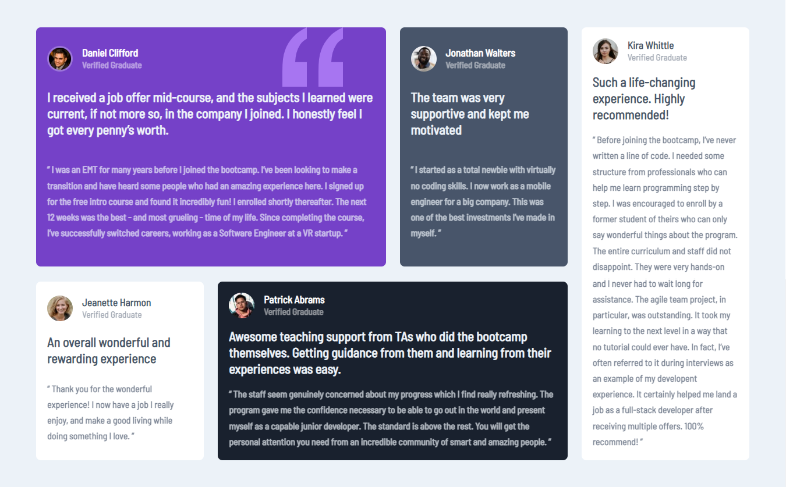

# Frontend Mentor - Testimonials grid section solution

This is a solution to the [Testimonials grid section challenge on Frontend Mentor](https://www.frontendmentor.io/challenges/testimonials-grid-section-Nnw6J7Un7). Frontend Mentor challenges help you improve your coding skills by building realistic projects. 

## Table of contents

- [Overview](#overview)
  - [The challenge](#the-challenge)
  - [Screenshot](#screenshot)
  - [Links](#links)
- [My process](#my-process)
  - [Built with](#built-with)
  - [What I learned](#what-i-learned)
- [Author](#author)

## Overview

### The challenge

Users should be able to:

- View the optimal layout for the site depending on their device's screen size

### Screenshot

-Mobile version-


 -Desktop version



### Links

- Solution URL: (https://www.frontendmentor.io/solutions/testimonials-grid-section-rrnlUacP3_/)
- Live Site URL: (https://cozy-truffle-347540.netlify.app/)

## My process

### Built with

- Semantic HTML5 markup
- CSS custom properties
- Flexbox
- CSS Grid
- Mobile-first workflow

### What I learned

```css
@media (min-width:47em) {

    .cards {
        grid-template-columns: repeat(4, 1fr);
        grid-template-rows:  1fr;
        grid-template-areas: 
            'a a b e'
            'c d d e'
                    ;
    }

    .cards> :nth-child(1) {
        grid-area: a;
    }

    .cards> :nth-child(2) {
        grid-area: b;
    }

    .cards> :nth-child(3) {
        grid-area: c;
    }

    .cards> :nth-child(4) {
        grid-area: d;
    }

    .cards> :nth-child(5) {
        grid-area: e;
    }
   
}
```

## Author

- Frontend Mentor - [@Aboubakr06](https://www.frontendmentor.io/profile/Aboubakr06)
- Twitter - [@elbouzidi99](https://twitter.com/elbouzidi99)

